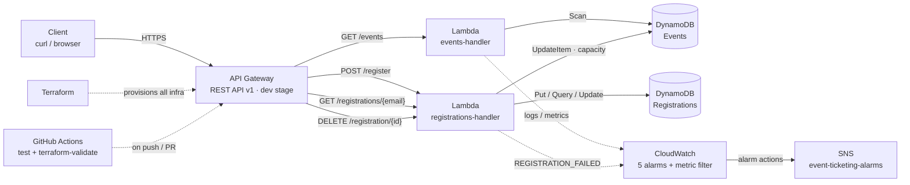

# Event Registration & Ticketing System

A fully serverless event registration API on AWS (API Gateway → Lambda → DynamoDB) that replaces a manual Forms + Excel workflow with a scalable, race-safe REST API. Infrastructure is defined with Terraform and verified by a GitHub Actions CI pipeline.

**Live API (dev stage):** `https://qhmocsswo9.execute-api.us-east-1.amazonaws.com/dev` *(yours will differ — see `terraform output api_base_url`)*

---

## Architecture



Full-resolution visual: [`docs/architecture-diagram.html`](docs/architecture-diagram.html) (open in a browser, screenshot-ready).

## Tech Stack

| Layer | Technology |
|---|---|
| API | AWS API Gateway (REST v1, `AWS_PROXY` integrations) |
| Compute | AWS Lambda (Python 3.12) |
| Data | DynamoDB (on-demand, 2 tables + 1 GSI) |
| Observability | CloudWatch (alarms, metric filter) + SNS |
| IaC | Terraform (AWS ~> 6.0, archive ~> 2.0) |
| CI/CD | GitHub Actions (pytest + terraform validate) |
| Tests | pytest + moto (offline AWS mocking) |

## API Reference

| Method | Path | Description | Success |
|---|---|---|---|
| `GET` | `/events` | List events with computed status | `200` |
| `POST` | `/register` | Register (body: `eventId`, `email`) | `201` |
| `GET` | `/registrations/{email}` | User's confirmed registrations | `200` |
| `DELETE` | `/registration/{id}` | Cancel a registration | `200` |

```bash
BASE=https://qhmocsswo9.execute-api.us-east-1.amazonaws.com/dev

curl $BASE/events
curl -X POST $BASE/register -H "Content-Type: application/json" \
  -d '{"eventId": "<eventId>", "email": "you@example.com"}'
curl $BASE/registrations/you@example.com
curl -X DELETE $BASE/registration/<registrationId>
```

Errors: `400` invalid input · `409` full/duplicate/already-cancelled · `404` not found · `405` bad method · `500` server error.

## Data Model

**Events** — `eventId` (PK) · `eventName` · `eventDate` · `totalCapacity` · `registeredCount`
**Registrations** — `registrationId` (PK) · `eventId` · `email` · `status` (`confirmed`/`cancelled`) · `registeredAt` · GSI `email-index`

## Key Design Decisions

- **Real capacity control** — `registeredCount` is incremented with a conditional write (`registeredCount < totalCapacity`), evaluated atomically by DynamoDB at commit time. Two simultaneous requests for the last seat: exactly one wins. Not a status badge.
- **No VPC** — every dependency (DynamoDB, API Gateway) is a managed service; a VPC would add cost and latency with zero security benefit.
- **Race-safe cancellation** — status flip is conditional (`confirmed` → `cancelled`), and the seat decrement requires `registeredCount > 0` — double-cancels return `409` and the counter can never underflow.
- **Dedupe** — same email + event can't hold two confirmed registrations; cancelled seats remain re-bookable.
- **Confirmed-only reads** — `GET /registrations/{email}` filters out cancelled rows.
- **Least-privilege IAM** — each Lambda's policy is scoped to exactly the tables/actions it uses.
- **REST API v1** — matches the brief's "REST endpoints" requirement.

## Project Structure

```
├── .github/workflows/ci.yml    # pytest + terraform validate on push/PR
├── lambdas/
│   ├── events/handler.py       # GET /events
│   └── registrations/handler.py # register / list / cancel
├── modules/                    # reusable dynamodb + lambda modules
├── tests/                      # 8 tests (pytest + moto)
├── docs/architecture-diagram.html
├── cloudwatch.tf · main.tf · versions.tf
├── seed.py                     # sample event data
└── README.md
```

## Local Development

```bash
python3 -m venv venv && source venv/bin/activate
pip install boto3 moto pytest
python -m pytest tests -q        # 8 passed (mocked AWS — no account needed)
```

## Deployment

```bash
terraform init && terraform apply   # provisions everything
terraform output api_base_url       # live URL
python seed.py                      # populate Events (incl. capacity-1 demo event)
```

## CI/CD

On every push/PR to `main`: **`test`** job runs the pytest suite (with `AWS_DEFAULT_REGION=us-east-1`), **`terraform-validate`** job runs `init -backend=false` + `validate`.

## Monitoring

5 CloudWatch alarms: Lambda `Errors` and `Throttles` (`> 0`) for both functions, plus a custom `REGISTRATION_FAILED` metric filter alarm (`≥ 3` in 5 min). All publish to SNS `event-ticketing-alarms` (email subscription; confirm via the link AWS emails you after deploy).

## Screenshots

*(insert screenshots — suggested: API Gateway routes · Lambda config · DynamoDB tables · live curl output · CloudWatch alarms · CI green run · terraform apply)*
